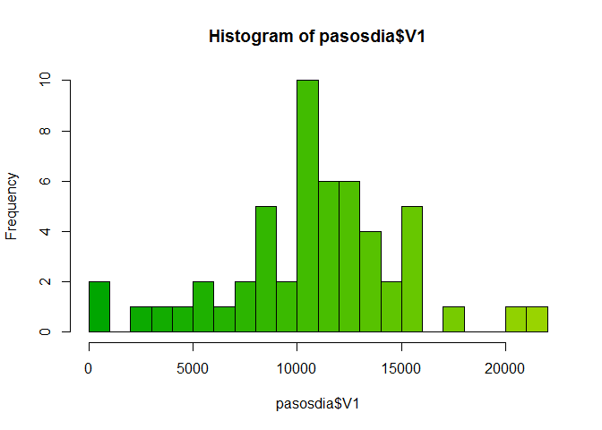
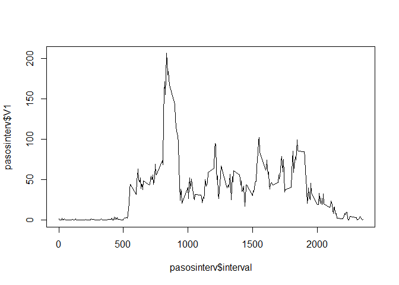
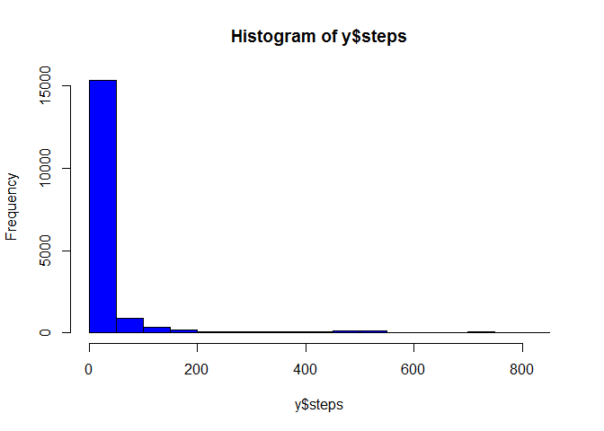
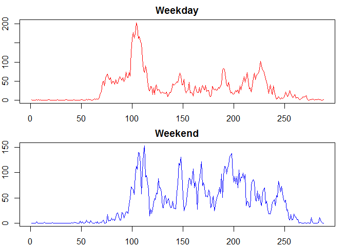

# Reproducible Research: Peer Assessment 1


## Loading and preprocessing the data

Needed data is loaded by


```r
library(data.table)
library(knitr)

act<-read.csv("activity.csv",header = TRUE,stringsAsFactors = FALSE,na.strings = "NA")
act$date<-as.Date(act$date,"%Y-%m-%d")
act<-data.table(act)
```

## What is mean total number of steps taken per day?
Means and medians are presented in the next table with the respective histogram


```r
pasosdia<-act[,sum(steps),by=date]
hist(pasosdia$V1,breaks=20,col=terrain.colors(length(unique(pasosdia$date))))
```



```r
act[,mean(steps,na.rm = TRUE),by=date]
```

```
##           date         V1
##  1: 2012-10-01        NaN
##  2: 2012-10-02  0.4375000
##  3: 2012-10-03 39.4166667
##  4: 2012-10-04 42.0694444
##  5: 2012-10-05 46.1597222
##  6: 2012-10-06 53.5416667
##  7: 2012-10-07 38.2465278
##  8: 2012-10-08        NaN
##  9: 2012-10-09 44.4826389
## 10: 2012-10-10 34.3750000
## 11: 2012-10-11 35.7777778
## 12: 2012-10-12 60.3541667
## 13: 2012-10-13 43.1458333
## 14: 2012-10-14 52.4236111
## 15: 2012-10-15 35.2048611
## 16: 2012-10-16 52.3750000
## 17: 2012-10-17 46.7083333
## 18: 2012-10-18 34.9166667
## 19: 2012-10-19 41.0729167
## 20: 2012-10-20 36.0937500
## 21: 2012-10-21 30.6284722
## 22: 2012-10-22 46.7361111
## 23: 2012-10-23 30.9652778
## 24: 2012-10-24 29.0104167
## 25: 2012-10-25  8.6527778
## 26: 2012-10-26 23.5347222
## 27: 2012-10-27 35.1354167
## 28: 2012-10-28 39.7847222
## 29: 2012-10-29 17.4236111
## 30: 2012-10-30 34.0937500
## 31: 2012-10-31 53.5208333
## 32: 2012-11-01        NaN
## 33: 2012-11-02 36.8055556
## 34: 2012-11-03 36.7048611
## 35: 2012-11-04        NaN
## 36: 2012-11-05 36.2465278
## 37: 2012-11-06 28.9375000
## 38: 2012-11-07 44.7326389
## 39: 2012-11-08 11.1770833
## 40: 2012-11-09        NaN
## 41: 2012-11-10        NaN
## 42: 2012-11-11 43.7777778
## 43: 2012-11-12 37.3784722
## 44: 2012-11-13 25.4722222
## 45: 2012-11-14        NaN
## 46: 2012-11-15  0.1423611
## 47: 2012-11-16 18.8923611
## 48: 2012-11-17 49.7881944
## 49: 2012-11-18 52.4652778
## 50: 2012-11-19 30.6979167
## 51: 2012-11-20 15.5277778
## 52: 2012-11-21 44.3993056
## 53: 2012-11-22 70.9270833
## 54: 2012-11-23 73.5902778
## 55: 2012-11-24 50.2708333
## 56: 2012-11-25 41.0902778
## 57: 2012-11-26 38.7569444
## 58: 2012-11-27 47.3819444
## 59: 2012-11-28 35.3576389
## 60: 2012-11-29 24.4687500
## 61: 2012-11-30        NaN
##           date         V1
```

```r
act[,as.double(median(steps,na.rm = TRUE)),by=date]
```

```
##           date V1
##  1: 2012-10-01 NA
##  2: 2012-10-02  0
##  3: 2012-10-03  0
##  4: 2012-10-04  0
##  5: 2012-10-05  0
##  6: 2012-10-06  0
##  7: 2012-10-07  0
##  8: 2012-10-08 NA
##  9: 2012-10-09  0
## 10: 2012-10-10  0
## 11: 2012-10-11  0
## 12: 2012-10-12  0
## 13: 2012-10-13  0
## 14: 2012-10-14  0
## 15: 2012-10-15  0
## 16: 2012-10-16  0
## 17: 2012-10-17  0
## 18: 2012-10-18  0
## 19: 2012-10-19  0
## 20: 2012-10-20  0
## 21: 2012-10-21  0
## 22: 2012-10-22  0
## 23: 2012-10-23  0
## 24: 2012-10-24  0
## 25: 2012-10-25  0
## 26: 2012-10-26  0
## 27: 2012-10-27  0
## 28: 2012-10-28  0
## 29: 2012-10-29  0
## 30: 2012-10-30  0
## 31: 2012-10-31  0
## 32: 2012-11-01 NA
## 33: 2012-11-02  0
## 34: 2012-11-03  0
## 35: 2012-11-04 NA
## 36: 2012-11-05  0
## 37: 2012-11-06  0
## 38: 2012-11-07  0
## 39: 2012-11-08  0
## 40: 2012-11-09 NA
## 41: 2012-11-10 NA
## 42: 2012-11-11  0
## 43: 2012-11-12  0
## 44: 2012-11-13  0
## 45: 2012-11-14 NA
## 46: 2012-11-15  0
## 47: 2012-11-16  0
## 48: 2012-11-17  0
## 49: 2012-11-18  0
## 50: 2012-11-19  0
## 51: 2012-11-20  0
## 52: 2012-11-21  0
## 53: 2012-11-22  0
## 54: 2012-11-23  0
## 55: 2012-11-24  0
## 56: 2012-11-25  0
## 57: 2012-11-26  0
## 58: 2012-11-27  0
## 59: 2012-11-28  0
## 60: 2012-11-29  0
## 61: 2012-11-30 NA
##           date V1
```

## What is the average daily activity pattern?
The time series plot is presented in next figure


```r
pasosinterv<-act[,mean(steps,na.rm = TRUE),by=interval]
plot(pasosinterv$interval,pasosinterv$V1,type="l")
```



Max value is 

```r
mayor<-which.max(pasosinterv$V1)
pasosinterv[mayor,]
```

```
##    interval       V1
## 1:      835 206.1698
```


## Imputing missing values

The total of missing values in the base is given by

```r
sum(complete.cases(act)==FALSE)
```

```
## [1] 2304
```
For removing the effect of missing data in the base, I decided to substitute it 
with the respective median value


```r
sust<-median(act$steps,na.rm = TRUE)
y<-act

for(i in 1:length(y$steps))
if(is.na(y$steps[i])){
  y$steps[i]<-sust
}
```

At the same time I generate a new base with the data replaced called y.
The histogram required and the means and medians are presented in the next block

```r
hist(y$steps,col="blue")
```



```r
y[,mean(steps),by=date]
```

```
##           date         V1
##  1: 2012-10-01  0.0000000
##  2: 2012-10-02  0.4375000
##  3: 2012-10-03 39.4166667
##  4: 2012-10-04 42.0694444
##  5: 2012-10-05 46.1597222
##  6: 2012-10-06 53.5416667
##  7: 2012-10-07 38.2465278
##  8: 2012-10-08  0.0000000
##  9: 2012-10-09 44.4826389
## 10: 2012-10-10 34.3750000
## 11: 2012-10-11 35.7777778
## 12: 2012-10-12 60.3541667
## 13: 2012-10-13 43.1458333
## 14: 2012-10-14 52.4236111
## 15: 2012-10-15 35.2048611
## 16: 2012-10-16 52.3750000
## 17: 2012-10-17 46.7083333
## 18: 2012-10-18 34.9166667
## 19: 2012-10-19 41.0729167
## 20: 2012-10-20 36.0937500
## 21: 2012-10-21 30.6284722
## 22: 2012-10-22 46.7361111
## 23: 2012-10-23 30.9652778
## 24: 2012-10-24 29.0104167
## 25: 2012-10-25  8.6527778
## 26: 2012-10-26 23.5347222
## 27: 2012-10-27 35.1354167
## 28: 2012-10-28 39.7847222
## 29: 2012-10-29 17.4236111
## 30: 2012-10-30 34.0937500
## 31: 2012-10-31 53.5208333
## 32: 2012-11-01  0.0000000
## 33: 2012-11-02 36.8055556
## 34: 2012-11-03 36.7048611
## 35: 2012-11-04  0.0000000
## 36: 2012-11-05 36.2465278
## 37: 2012-11-06 28.9375000
## 38: 2012-11-07 44.7326389
## 39: 2012-11-08 11.1770833
## 40: 2012-11-09  0.0000000
## 41: 2012-11-10  0.0000000
## 42: 2012-11-11 43.7777778
## 43: 2012-11-12 37.3784722
## 44: 2012-11-13 25.4722222
## 45: 2012-11-14  0.0000000
## 46: 2012-11-15  0.1423611
## 47: 2012-11-16 18.8923611
## 48: 2012-11-17 49.7881944
## 49: 2012-11-18 52.4652778
## 50: 2012-11-19 30.6979167
## 51: 2012-11-20 15.5277778
## 52: 2012-11-21 44.3993056
## 53: 2012-11-22 70.9270833
## 54: 2012-11-23 73.5902778
## 55: 2012-11-24 50.2708333
## 56: 2012-11-25 41.0902778
## 57: 2012-11-26 38.7569444
## 58: 2012-11-27 47.3819444
## 59: 2012-11-28 35.3576389
## 60: 2012-11-29 24.4687500
## 61: 2012-11-30  0.0000000
##           date         V1
```

```r
y[,median(steps),by=date]
```

```
##           date V1
##  1: 2012-10-01  0
##  2: 2012-10-02  0
##  3: 2012-10-03  0
##  4: 2012-10-04  0
##  5: 2012-10-05  0
##  6: 2012-10-06  0
##  7: 2012-10-07  0
##  8: 2012-10-08  0
##  9: 2012-10-09  0
## 10: 2012-10-10  0
## 11: 2012-10-11  0
## 12: 2012-10-12  0
## 13: 2012-10-13  0
## 14: 2012-10-14  0
## 15: 2012-10-15  0
## 16: 2012-10-16  0
## 17: 2012-10-17  0
## 18: 2012-10-18  0
## 19: 2012-10-19  0
## 20: 2012-10-20  0
## 21: 2012-10-21  0
## 22: 2012-10-22  0
## 23: 2012-10-23  0
## 24: 2012-10-24  0
## 25: 2012-10-25  0
## 26: 2012-10-26  0
## 27: 2012-10-27  0
## 28: 2012-10-28  0
## 29: 2012-10-29  0
## 30: 2012-10-30  0
## 31: 2012-10-31  0
## 32: 2012-11-01  0
## 33: 2012-11-02  0
## 34: 2012-11-03  0
## 35: 2012-11-04  0
## 36: 2012-11-05  0
## 37: 2012-11-06  0
## 38: 2012-11-07  0
## 39: 2012-11-08  0
## 40: 2012-11-09  0
## 41: 2012-11-10  0
## 42: 2012-11-11  0
## 43: 2012-11-12  0
## 44: 2012-11-13  0
## 45: 2012-11-14  0
## 46: 2012-11-15  0
## 47: 2012-11-16  0
## 48: 2012-11-17  0
## 49: 2012-11-18  0
## 50: 2012-11-19  0
## 51: 2012-11-20  0
## 52: 2012-11-21  0
## 53: 2012-11-22  0
## 54: 2012-11-23  0
## 55: 2012-11-24  0
## 56: 2012-11-25  0
## 57: 2012-11-26  0
## 58: 2012-11-27  0
## 59: 2012-11-28  0
## 60: 2012-11-29  0
## 61: 2012-11-30  0
##           date V1
```

The values replaced does not seem to generate a big chance in tendences.

## Are there differences in activity patterns between weekdays and weekends?
Plot required with the differences between the days is presented


```r
for(i in 1:length(y$date)){
  if(weekdays(y$date[i])%in%c("sábado","domingo")){
    y$wd[i]<-"weekend"
  }else{
    y$wd[i]<-"weekday"
  }
}

y$wd<-factor(y$wd)

par(mfrow=c(2,1),mar=c(2,2,2,1))
plot(y[wd=="weekday",mean(steps),by=interval]$V1,type="l",col="red",
     main="Weekday")
plot(y[wd=="weekend",mean(steps),by=interval]$V1,type="l",col="blue",
     main="Weekend")
```



```r
dev.off()
```

```
## null device 
##           1
```

